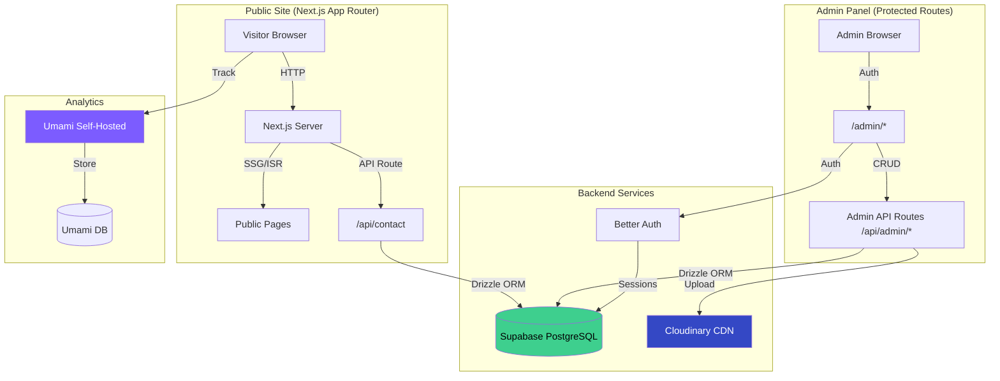
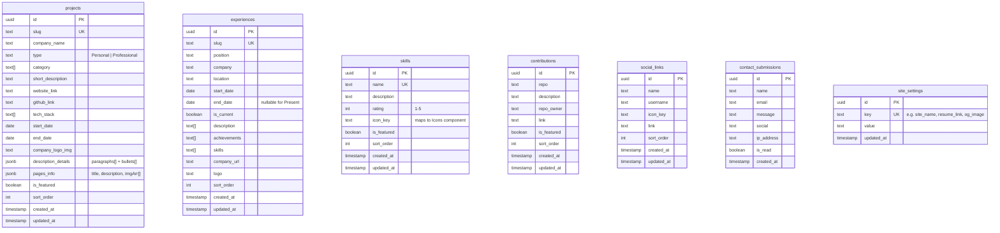
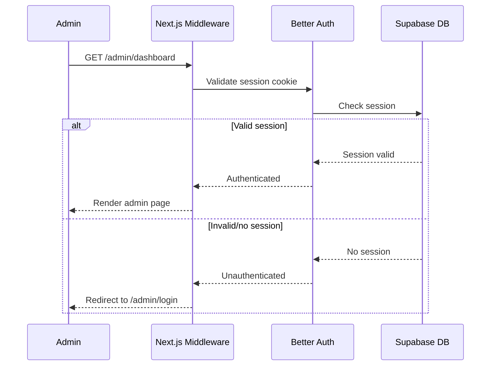
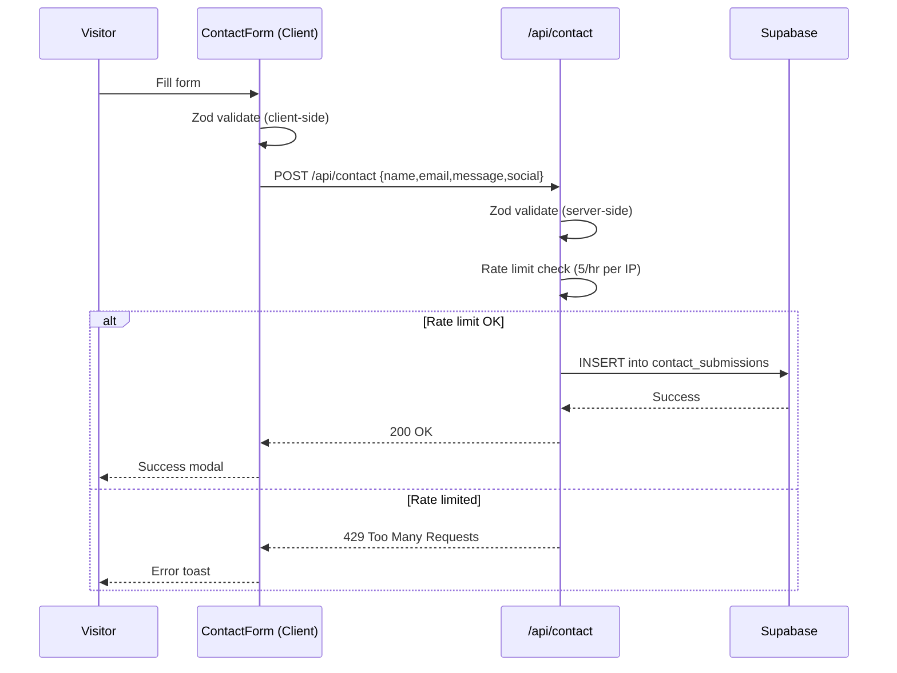

# PRD: Static-to-Dynamic CMS Portfolio Migration

## 1. Executive Summary

### Problem Statement

The current portfolio website stores all content (projects, experience, skills, contributions, social links, site metadata) as **hardcoded TypeScript objects** in `config/` files, and uses **Google Forms** as the contact form backend. Every content change requires a code commit, rebuild, and redeploy — creating unnecessary friction and making the site impossible to manage for non-technical collaborators.

### Proposed Solution

Migrate the portfolio to a **dynamic CMS-backed architecture** powered by **Supabase** (PostgreSQL), replacing all static `config/*.ts` files with database-driven content, replacing Google Forms with a database-persisted contact system, adding an **admin panel** built with **shadcn/ui** for full CRUD content management, and replacing Google Analytics with **self-hosted Umami** for privacy-respecting analytics.

### Success Criteria

| KPI | Target |
|---|---|
| Content update time (new project/experience) | < 2 minutes via admin panel (vs. ~15 min code-commit cycle) |
| Public page Time to First Byte (TTFB) | ≤ 200ms via ISR/SSG caching |
| Contact form submission success rate | ≥ 99% (vs. current Google Form relay which has no error handling) |
| Lighthouse Performance score (public pages) | ≥ 90 |
| Admin panel authentication latency | < 500ms login round-trip |
| Zero-downtime migration | All existing content preserved with data parity |

---

## 2. User Experience & Functionality

### User Personas

| Persona | Description | Goals |
|---|---|---|
| **Owner/Admin** | The portfolio owner who manages content | Add/edit/delete projects, experience, skills, contributions; manage profile info; view contact submissions; monitor analytics |
| **Visitor** | Recruiters, collaborators, developers browsing the portfolio | View projects, experience, skills, read blogs, submit contact form, download resume |

### User Stories

#### Visitor Stories

| ID | Story | Acceptance Criteria |
|---|---|---|
| V-1 | As a **visitor**, I want to browse projects so that I can evaluate the owner's work | • Projects load from database with images, descriptions, tech stack<br>• Category filtering works identically to current behavior<br>• Page loads in < 1.5s on 3G |
| V-2 | As a **visitor**, I want to submit a contact form so that I can reach the portfolio owner | • Form validates name (min 3 chars), email, message (min 10 chars), optional social URL<br>• Submission is saved to `contact_submissions` table<br>• Success/error modal feedback shown<br>• Rate limited to 5 submissions per IP per hour |
| V-3 | As a **visitor**, I want to view experience timeline so that I can understand the owner's career | • Experience entries render in chronological order from DB<br>• All fields (position, company, location, dates, achievements, skills) displayed |
| V-4 | As a **visitor**, I want to download the resume so I can review it offline | • Resume link is fetched from `site_settings` table<br>• Opens in new tab or triggers download |
| V-5 | As a **visitor**, I want to view skills so I can understand the owner's technical proficiency | • Skills render with icon, name, description, and rating from DB |

#### Admin Stories

| ID | Story | Acceptance Criteria |
|---|---|---|
| A-1 | As an **admin**, I want to log in securely so that only I can manage content | • Better Auth with email/password (single admin account)<br>• Session persists with HTTP-only cookies<br>• Protected `/admin/*` routes redirect unauthenticated users to login<br>• Login page built with shadcn/ui `Card`, `Input`, `Button` |
| A-2 | As an **admin**, I want to create/edit/delete projects so I can keep my portfolio current | • CRUD form built with shadcn/ui components (Form, Input, Textarea, Select, Switch)<br>• Image/video upload to Cloudinary via shadcn `Dialog` modal<br>• Data table with shadcn `Table` + sorting/filtering<br>• Revalidation triggers on save to update public pages |
| A-3 | As an **admin**, I want to manage experience entries so they reflect my career accurately | • CRUD form with all [ExperienceInterface](file:///d:/PEMROGRAMAN/PORTFOLIO%20NEW/my-portfolio/config/experience.ts#3-16) fields using shadcn/ui<br>• Support for "Present" as end date via shadcn `Switch`<br>• Inline ordering/drag-sort |
| A-4 | As an **admin**, I want to manage skills so my tech stack stays up to date | • CRUD form with name, description, rating (1-5 via shadcn `Slider`), icon selection via `Select`<br>• Featured skills toggle via shadcn `Switch` |
| A-5 | As an **admin**, I want to view contact submissions so I don't miss messages | • Paginated data table with shadcn `Table` + search/filter<br>• Mark as read/unread via `Badge` indicators<br>• Detail view in shadcn `Sheet` side panel |
| A-6 | As an **admin**, I want to manage contributions so my open-source work is visible | • CRUD form with shadcn/ui components<br>• List view with shadcn `Table` |
| A-7 | As an **admin**, I want to manage social links and site settings from one place | • Settings form with shadcn `Tabs` for sections (Profile, Social, SEO)<br>• Changes reflected on public site after revalidation |

### Non-Goals (Out of Scope for MVP)

- Multi-user / team collaboration features
- Blog CMS migration (stays as MDX/markdown files for now)
- Real-time collaborative editing
- Email notification system for contact submissions
- Media CDN integration beyond Supabase Storage
- i18n / multi-language support
- Comments / reactions system on projects

---

## 3. Technical Specifications

### Architecture Overview



### Current Architecture (Being Replaced)

| Component | Current | New |
|---|---|---|
| **Data Source** | Static TS files (`config/*.ts`) | Supabase PostgreSQL via Drizzle ORM |
| **Contact Backend** | Google Forms prefilled link relay | Direct DB insert via API route |
| **Authentication** | None | Better Auth (email/password) |
| **Admin UI** | None | **shadcn/ui** (already configured in project) |
| **Analytics** | Google Analytics (`@next/third-parties`) | Umami (self-hosted, privacy-friendly) |
| **Validation** | Zod (already installed) | Zod (keep, shared schemas) |
| **Form Handling** | React Hook Form (already installed) | React Hook Form (keep, extend to admin) |
| **ORM** | None | Drizzle ORM |
| **File Storage** | Static `public/` folder | **Cloudinary** (images, videos, PDFs) + `public/` fallback |

---

### Database Schema (Supabase PostgreSQL + Drizzle ORM)



### Drizzle Schema Definition (Key Example)

```typescript
// db/schema/projects.ts
import { pgTable, uuid, text, date, boolean, integer, jsonb, timestamp } from "drizzle-orm/pg-core";

export const projects = pgTable("projects", {
  id: uuid("id").defaultRandom().primaryKey(),
  slug: text("slug").unique().notNull(),
  companyName: text("company_name").notNull(),
  type: text("type").notNull(), // "Personal" | "Professional"
  category: text("category").array().notNull(),
  shortDescription: text("short_description").notNull(),
  websiteLink: text("website_link"),
  githubLink: text("github_link"),
  techStack: text("tech_stack").array().notNull(),
  startDate: date("start_date").notNull(),
  endDate: date("end_date").notNull(),
  companyLogoImg: text("company_logo_img"),
  descriptionDetails: jsonb("description_details").notNull(),
  pagesInfo: jsonb("pages_info").notNull(),
  isFeatured: boolean("is_featured").default(false),
  sortOrder: integer("sort_order").default(0),
  createdAt: timestamp("created_at").defaultNow(),
  updatedAt: timestamp("updated_at").defaultNow(),
});
```

---

### Authentication (Better Auth)

| Aspect | Detail |
|---|---|
| **Provider** | Email/password only (single admin) |
| **Session** | Database-backed sessions in Supabase |
| **Middleware** | Next.js middleware to protect `/admin/*` routes |
| **Admin Creation** | Seed script creates admin account on first deploy |



---

### API Design

#### Public Endpoints (No Auth)

| Method | Endpoint | Description |
|---|---|---|
| `GET` | `/api/projects` | List all projects (cached, ISR) |
| `GET` | `/api/projects/[slug]` | Get single project |
| `GET` | `/api/experience` | List all experiences |
| `GET` | `/api/skills` | List all skills |
| `GET` | `/api/contributions` | List all contributions |
| `GET` | `/api/site-settings` | Get public site settings |
| [POST](file:///d:/PEMROGRAMAN/PORTFOLIO%20NEW/my-portfolio/app/api/contact/route.ts#3-31) | `/api/contact` | Submit contact form (rate-limited) |

#### Admin Endpoints (Better Auth Protected)

| Method | Endpoint | Description |
|---|---|---|
| `GET` | `/api/admin/projects` | List projects (with drafts) |
| [POST](file:///d:/PEMROGRAMAN/PORTFOLIO%20NEW/my-portfolio/app/api/contact/route.ts#3-31) | `/api/admin/projects` | Create project |
| `PUT` | `/api/admin/projects/[id]` | Update project |
| `DELETE` | `/api/admin/projects/[id]` | Delete project |
| [POST](file:///d:/PEMROGRAMAN/PORTFOLIO%20NEW/my-portfolio/app/api/contact/route.ts#3-31) | `/api/admin/upload` | Upload media to Cloudinary (images, videos, PDFs) |
| `GET` | `/api/admin/contacts` | List contact submissions |
| `PATCH` | `/api/admin/contacts/[id]` | Mark read/unread |
| `PUT` | `/api/admin/site-settings` | Update site settings |

> Repeat the CRUD pattern for `experience`, [skills](file:///d:/PEMROGRAMAN/PORTFOLIO%20NEW/my-portfolio/config/skills.ts#3-9), [contributions](file:///d:/PEMROGRAMAN/PORTFOLIO%20NEW/my-portfolio/config/contributions.ts#1-7), `social-links`.

#### Revalidation Strategy

```typescript
// After any admin CRUD operation:
import { revalidatePath, revalidateTag } from "next/cache";

// Revalidate specific pages
revalidatePath("/");          // Home page
revalidatePath("/projects");  // Projects listing
revalidateTag("projects");    // Tagged fetch cache
```

---

### Analytics (Umami → Replacing Google Analytics)

| Aspect | Detail |
|---|---|
| **Platform** | Umami (self-hosted on Vercel/Railway or Umami Cloud) |
| **Why replace GA?** | Privacy-friendly, no cookie banner needed, GDPR compliant out-of-box, lighter script (~2KB vs ~45KB) |
| **Integration** | Single `<script>` tag in [app/layout.tsx](file:///d:/PEMROGRAMAN/PORTFOLIO%20NEW/my-portfolio/app/layout.tsx) |
| **Tracking** | Page views, custom events (contact form submit, resume download, project click) |

**Replace in [layout.tsx](file:///d:/PEMROGRAMAN/PORTFOLIO%20NEW/my-portfolio/app/layout.tsx):**
```diff
- import { GoogleAnalytics } from "@next/third-parties/google";
- <GoogleAnalytics gaId={GA_ID} />
+ <script
+   defer
+   src="https://your-umami-instance.com/script.js"
+   data-website-id="your-website-id"
+ />
```

---

### Validation (Zod — Shared Schemas)

Shared Zod schemas between client forms and API routes:

```typescript
// lib/validations/project.ts
import { z } from "zod";

export const projectSchema = z.object({
  companyName: z.string().min(1, "Company name is required"),
  type: z.enum(["Personal", "Professional"]),
  category: z.array(z.string()).min(1),
  shortDescription: z.string().min(10).max(500),
  websiteLink: z.string().url().optional().or(z.literal("")),
  githubLink: z.string().url().optional().or(z.literal("")),
  techStack: z.array(z.string()).min(1),
  startDate: z.string().date(),
  endDate: z.string().date(),
  descriptionDetails: z.object({
    paragraphs: z.array(z.string()),
    bullets: z.array(z.string()),
  }),
});

// lib/validations/contact.ts (already exists, extracts to shared)
export const contactSchema = z.object({
  name: z.string().min(3),
  email: z.string().email(),
  message: z.string().min(10),
  social: z.string().url().optional().or(z.literal("")),
});
```

---

### Contact Form Flow (New)



---

### Security & Privacy

| Concern | Mitigation |
|---|---|
| **Admin access** | Better Auth with HTTP-only session cookies, middleware protection |
| **SQL injection** | Drizzle ORM parameterized queries |
| **Contact spam** | IP-based rate limiting (5/hr), Zod server-side validation |
| **XSS** | React's built-in output escaping + sanitize rich text inputs |
| **CSRF** | SameSite cookie policy + Better Auth CSRF tokens |
| **File uploads** | Validate MIME type, max file size (10MB), Cloudinary server-side upload with signed presets |
| **Env secrets** | All secrets server-side only; no `NEXT_PUBLIC_` for DB/auth/Cloudinary credentials |
| **Analytics privacy** | Umami is cookie-free and GDPR compliant by default |

---

### Admin Panel UI (shadcn/ui)

The project already has shadcn/ui configured ([components.json](file:///d:/PEMROGRAMAN/PORTFOLIO%20NEW/my-portfolio/components.json) with `zinc` base color, CSS variables enabled). The admin panel will leverage **existing** and **new** shadcn/ui components:

#### shadcn/ui Components Required

| Component | Usage | Status |
|---|---|---|
| `Button` | All actions (save, delete, cancel) | ✅ Already installed |
| `Input` | Text fields in all CRUD forms | ✅ Already installed |
| `Label` | Form labels | ✅ Already installed |
| `Dialog` | Confirmation modals, image upload | ✅ Already installed |
| `Toast` / `Toaster` | Success/error notifications | ✅ Already installed |
| `Tooltip` | Icon button hints | ✅ Already installed |
| `Tabs` | Settings page sections | ✅ Already installed |
| `Textarea` | Long text fields (descriptions) | 🆕 Install via `npx shadcn@latest add textarea` |
| `Table` | Data tables for projects, contacts, etc. | 🆕 Install via `npx shadcn@latest add table` |
| `Select` | Dropdowns (type, category, icon) | 🆕 Install via `npx shadcn@latest add select` |
| `Switch` | Boolean toggles (featured, is_current) | 🆕 Install via `npx shadcn@latest add switch` |
| `Badge` | Status indicators (read/unread, type) | 🆕 Install via `npx shadcn@latest add badge` |
| `Card` | Content cards in dashboard/login | 🆕 Install via `npx shadcn@latest add card` |
| `Sheet` | Side panel for contact detail view | 🆕 Install via `npx shadcn@latest add sheet` |
| `Separator` | Visual dividers in forms/layout | 🆕 Install via `npx shadcn@latest add separator` |
| `Skeleton` | Loading states for admin data fetching | 🆕 Install via `npx shadcn@latest add skeleton` |
| `Alert` | Warning/info banners in admin | 🆕 Install via `npx shadcn@latest add alert` |
| `Avatar` | Admin profile in sidebar | 🆕 Install via `npx shadcn@latest add avatar` |
| `Sidebar` | Admin panel navigation | 🆕 Install via `npx shadcn@latest add sidebar` |

#### Admin Layout Design

```
┌─────────────────────────────────────────────────────┐
│  Admin Panel                          [Avatar] [⚙]  │
├──────────┬──────────────────────────────────────────┤
│          │                                          │
│ Sidebar  │  Content Area                            │
│          │                                          │
│ 📊 Dash  │  ┌─────────────────────────────────────┐ │
│ 📁 Proj  │  │  Page Title            [+ Add New]  │ │
│ 💼 Exp   │  ├─────────────────────────────────────┤ │
│ ⚡ Skills │  │  shadcn/ui Table                     │ │
│ 🔗 Contr │  │  with sorting, filtering, pagination│ │
│ 📧 Msgs  │  │                                     │ │
│ ⚙ Config │  │  [Edit] [Delete] actions per row     │ │
│          │  └─────────────────────────────────────┘ │
│          │                                          │
└──────────┴──────────────────────────────────────────┘
```

#### Admin Form Pattern (shadcn/ui + React Hook Form + Zod)

```typescript
// Example: Admin project form using shadcn/ui + RHF + Zod
import { useForm } from "react-hook-form";
import { zodResolver } from "@hookform/resolvers/zod";
import { projectSchema } from "@/lib/validations/project";
import { Button } from "@/components/ui/button";
import { Input } from "@/components/ui/input";
import { Textarea } from "@/components/ui/textarea";
import { Select, SelectContent, SelectItem, SelectTrigger, SelectValue } from "@/components/ui/select";
import { Switch } from "@/components/ui/switch";
import { Form, FormControl, FormField, FormItem, FormLabel, FormMessage } from "@/components/ui/form";
import { Card, CardContent, CardHeader, CardTitle } from "@/components/ui/card";

export function ProjectForm({ defaultValues, onSubmit }) {
  const form = useForm({
    resolver: zodResolver(projectSchema),
    defaultValues,
  });

  return (
    <Card>
      <CardHeader>
        <CardTitle>Project Details</CardTitle>
      </CardHeader>
      <CardContent>
        <Form {...form}>
          <form onSubmit={form.handleSubmit(onSubmit)}>
            <FormField name="companyName" control={form.control} render={({ field }) => (
              <FormItem>
                <FormLabel>Company Name</FormLabel>
                <FormControl><Input {...field} /></FormControl>
                <FormMessage />
              </FormItem>
            )} />
            <FormField name="type" control={form.control} render={({ field }) => (
              <FormItem>
                <FormLabel>Type</FormLabel>
                <Select onValueChange={field.onChange} defaultValue={field.value}>
                  <SelectTrigger><SelectValue /></SelectTrigger>
                  <SelectContent>
                    <SelectItem value="Personal">Personal</SelectItem>
                    <SelectItem value="Professional">Professional</SelectItem>
                  </SelectContent>
                </Select>
                <FormMessage />
              </FormItem>
            )} />
            <FormField name="isFeatured" control={form.control} render={({ field }) => (
              <FormItem className="flex items-center gap-2">
                <FormLabel>Featured</FormLabel>
                <FormControl><Switch checked={field.value} onCheckedChange={field.onChange} /></FormControl>
              </FormItem>
            )} />
            <Button type="submit">Save Project</Button>
          </form>
        </Form>
      </CardContent>
    </Card>
  );
}
```

---

### File & Folder Structure (New/Modified)

```
my-portfolio/
├── app/
│   ├── (root)/              # Existing public routes (unchanged routes)
│   ├── admin/               # [NEW] Admin panel routes (shadcn/ui)
│   │   ├── layout.tsx       # Admin layout with shadcn Sidebar nav
│   │   ├── login/page.tsx   # Login with shadcn Card + Input
│   │   ├── dashboard/page.tsx
│   │   ├── projects/page.tsx  # shadcn Table + Dialog forms
│   │   ├── experience/page.tsx
│   │   ├── skills/page.tsx
│   │   ├── contributions/page.tsx
│   │   ├── contacts/page.tsx  # shadcn Table + Sheet detail
│   │   └── settings/page.tsx  # shadcn Tabs for sections
│   └── api/
│       ├── admin/           # [NEW] Protected admin API
│       │   ├── projects/route.ts
│       │   ├── experience/route.ts
│       │   ├── skills/route.ts
│       │   ├── contributions/route.ts
│       │   ├── contacts/route.ts
│       │   ├── settings/route.ts
│       │   └── upload/route.ts
│       ├── auth/[...all]/route.ts  # [NEW] Better Auth handler
│       └── contact/route.ts        # [MODIFY] Google Form → DB insert
├── db/                      # [NEW] Database layer
│   ├── index.ts             # Drizzle client
│   ├── schema/              # Table definitions
│   │   ├── projects.ts
│   │   ├── experiences.ts
│   │   ├── skills.ts
│   │   ├── contributions.ts
│   │   ├── social-links.ts
│   │   ├── contact-submissions.ts
│   │   ├── site-settings.ts
│   │   └── auth.ts          # Better Auth tables
│   ├── migrations/          # Drizzle migration files
│   └── seed.ts              # Seed script (migrate static → DB)
├── lib/
│   ├── auth.ts              # [NEW] Better Auth server config
│   ├── auth-client.ts       # [NEW] Better Auth client
│   ├── validations/         # [NEW] Shared Zod schemas
│   └── utils.ts             # Existing
├── components/
│   ├── ui/                  # shadcn/ui components (existing + new)
│   ├── admin/               # [NEW] Admin-specific composed components
│   │   ├── sidebar-nav.tsx  # Admin sidebar using shadcn Sidebar
│   │   ├── data-table.tsx   # Reusable data table wrapper
│   │   ├── project-form.tsx # Project CRUD form
│   │   ├── experience-form.tsx
│   │   ├── skill-form.tsx
│   │   ├── contribution-form.tsx
│   │   ├── contact-detail.tsx  # Contact Sheet panel
│   │   └── settings-form.tsx
│   └── forms/
│       └── contact-form.tsx # [MODIFY] Remove Google Form, use DB
├── middleware.ts             # [NEW] Auth middleware for /admin/*
├── drizzle.config.ts        # [NEW] Drizzle config
├── components.json          # [EXISTING] shadcn/ui config
└── .env                     # [MODIFY] New env vars
```

### Environment Variables (New)

```env
# Supabase (Database Only)
DATABASE_URL=postgresql://...
DIRECT_URL=postgresql://...  # For migrations

# Cloudinary (Media Storage)
CLOUDINARY_CLOUD_NAME=xxx
CLOUDINARY_API_KEY=xxx
CLOUDINARY_API_SECRET=xxx        # Server-side only
NEXT_PUBLIC_CLOUDINARY_CLOUD_NAME=xxx  # For client-side image URLs

# Better Auth
BETTER_AUTH_SECRET=xxx
BETTER_AUTH_URL=https://yoursite.com

# Umami Analytics
NEXT_PUBLIC_UMAMI_URL=https://your-umami.com
NEXT_PUBLIC_UMAMI_WEBSITE_ID=xxx

# Resume (now managed via DB site_settings, but keep as fallback)
NEXT_PUBLIC_RESUME_LINK=xxx
```

### Media Storage (Cloudinary)

Cloudinary handles **all media assets** — images, videos, PDFs, and other files. Supabase is used exclusively as the database.

| Aspect | Detail |
|---|---|
| **Provider** | Cloudinary (free tier: 25GB storage, 25GB bandwidth/month) |
| **Upload flow** | Admin uploads via server-side API → Cloudinary SDK → returns `secure_url` → stored in DB |
| **Delivery** | Cloudinary CDN with automatic format optimization (WebP/AVIF) and responsive transformations |
| **File types** | Images (jpg, png, webp, svg), Videos (mp4, webm), Documents (PDF) |
| **Transformations** | Auto-resize, crop, quality optimization via URL params (e.g., `w_800,q_auto,f_auto`) |
| **Folder structure** | `portfolio/projects/`, `portfolio/experience/`, `portfolio/profile/`, `portfolio/resume/` |

#### Upload API Pattern

```typescript
// app/api/admin/upload/route.ts
import { v2 as cloudinary } from "cloudinary";

cloudinary.config({
  cloud_name: process.env.CLOUDINARY_CLOUD_NAME,
  api_key: process.env.CLOUDINARY_API_KEY,
  api_secret: process.env.CLOUDINARY_API_SECRET,
});

export async function POST(req: Request) {
  // Auth check via Better Auth...
  const formData = await req.formData();
  const file = formData.get("file") as File;
  const folder = formData.get("folder") as string; // e.g. "portfolio/projects"

  const bytes = await file.arrayBuffer();
  const buffer = Buffer.from(bytes);

  const result = await new Promise((resolve, reject) => {
    cloudinary.uploader.upload_stream(
      {
        folder,
        resource_type: "auto", // auto-detect image/video/raw
        allowed_formats: ["jpg", "png", "webp", "svg", "mp4", "webm", "pdf"],
        max_bytes: 10_000_000, // 10MB limit
      },
      (error, result) => (error ? reject(error) : resolve(result))
    ).end(buffer);
  });

  return Response.json({
    url: result.secure_url,
    public_id: result.public_id,
  });
}
```

#### Image URL Optimization

```typescript
// lib/cloudinary.ts — helper for optimized image URLs
export function getOptimizedImageUrl(
  url: string,
  options: { width?: number; height?: number; quality?: string } = {}
) {
  const { width = 800, quality = "auto" } = options;
  // Transform: https://res.cloudinary.com/xxx/image/upload/v123/folder/file.jpg
  // Into:     https://res.cloudinary.com/xxx/image/upload/w_800,q_auto,f_auto/v123/folder/file.jpg
  return url.replace("/upload/", `/upload/w_${width},q_${quality},f_auto/`);
}
```

---

## 4. Data Migration Strategy

### Seed Script

A seed script (`db/seed.ts`) will programmatically migrate all existing static data:

```typescript
// Pseudocode
import { Projects } from "@/config/projects";
import { experiences } from "@/config/experience";
import { skillsUnsorted } from "@/config/skills";
import { contributionsUnsorted } from "@/config/contributions";
import { SocialLinks } from "@/config/socials";
import { siteConfig } from "@/config/site";

// For each static array → INSERT into corresponding table
// Preserve all fields, generate UUIDs, set timestamps
```

After migration is verified, the `config/` static files can be archived (not deleted immediately, kept as backup).

---

## 5. Risks & Roadmap

### Phased Rollout

| Phase | Scope | Timeline |
|---|---|---|
| **MVP (Phase 1)** | DB schema + Drizzle + seed migration + public pages read from DB + contact form to DB + Better Auth login + basic admin CRUD for projects/experience/skills | 2-3 weeks |
| **v1.1 (Phase 2)** | Full admin panel (contributions, social links, site settings) + Cloudinary media uploads + Umami analytics integration | 1-2 weeks |
| **v2.0 (Phase 3)** | Blog CMS migration (MDX → DB) + admin dashboard with analytics widgets + email notifications for contact submissions + image optimization pipeline | Future |

### Technical Risks

| Risk | Likelihood | Impact | Mitigation |
|---|---|---|---|
| Supabase free-tier compute limits (same issue as previous Neon) | Medium | High | Use connection pooling (Supavisor), implement aggressive caching with ISR, minimize DB calls on public pages |
| Better Auth version instability (relatively new library) | Low | Medium | Pin exact version, write adapter tests, have fallback plan to NextAuth if critical bugs |
| Drizzle migration conflicts | Low | Medium | Use migration snapshots, test in staging before production |
| Data loss during migration | Low | High | Keep static `config/` files as backup, verify row counts post-seed, run in transaction |
| Admin panel adds attack surface | Medium | High | Rate limiting, CSRF tokens, input sanitization, RLS policies on Supabase |

---

## 6. Verification Plan

### Automated Tests

1. **Seed migration test**: Run `db/seed.ts` and verify row counts match static arrays:
   - Projects: 10 rows
   - Experiences: 3 rows
   - Skills: 21 rows
   - Contributions: 5 rows
   - Social Links: 4 rows

2. **API route tests**: Use Vitest or Playwright to test:
   - `GET /api/projects` returns all projects
   - `POST /api/contact` with valid data → 200
   - `POST /api/contact` with invalid data → 400
   - `POST /api/admin/projects` without auth → 401

3. **Build verification**: `npm run build` must complete without errors

### Manual Verification

1. **Visual parity**: Compare public pages before/after migration — content must be identical
2. **Admin flow**: Login → Create project → Verify it appears on public site
3. **Contact form**: Submit form → Verify entry in Supabase dashboard
4. **Analytics**: Visit pages → Verify page views appear in Umami dashboard
